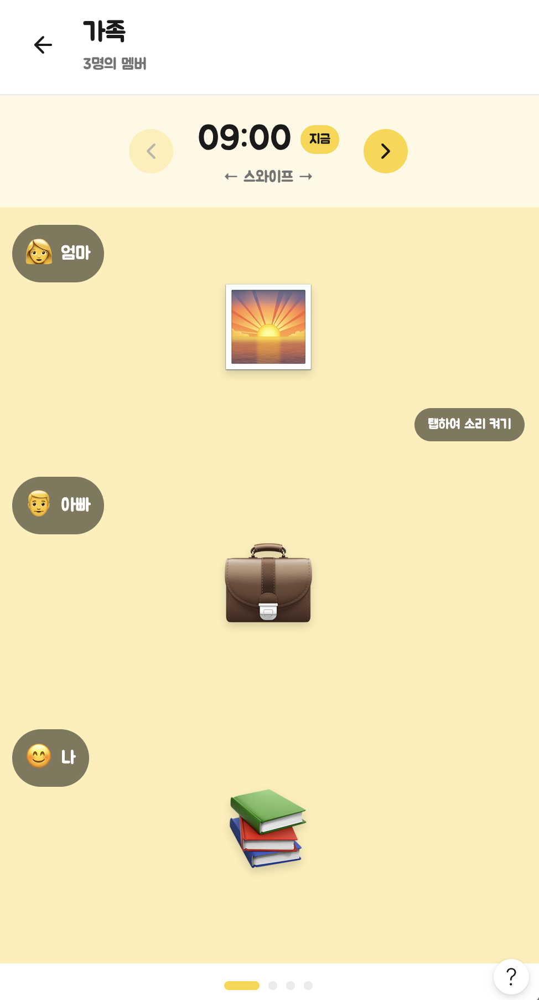
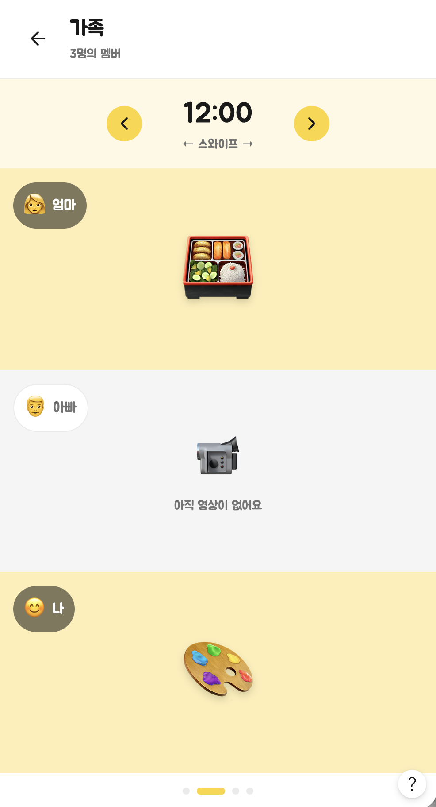

# group-detail — UI

## 목업

### 활성 시간대 (멤버 전원 업로드 완료)


> 09:00 슬롯, 가족 그룹(엄마·아빠·나) 모두 영상 업로드된 상태. 노란 배경 = 활성 슬롯. "탭하여 소리 켜기" 토스트 1회 노출.

### 미업로드 멤버 포함 슬롯


> 12:00 슬롯, 아빠가 미업로드 상태. 회색 배경 + 카메라 아이콘 + "아직 영상이 없어요" placeholder. 멤버 칩도 화이트 배경으로 차별화.

## 레이아웃

### 1. 헤더
- 좌측 ← 뒤로가기
- 가운데 (또는 좌측 정렬): 그룹명(굵게) + "N명의 멤버"(서브)
- 우측 슬롯 (향후): 채팅 진입 / 메뉴

### 2. 시간 네비게이터 (상단 옅은 노란 배경 띠)
- 좌측 노란 원형 ← 버튼: 이전 시간대
- 가운데: 큰 시각 텍스트 "HH:MM" + (조건부) **지금** 노란 칩
- 우측 노란 원형 → 버튼: 다음 시간대 (미래 시간대는 disabled 또는 hidden)
- 하단 안내: "← 스와이프 →"
- 이 띠 자체도 좌우 스와이프 제스처를 받아 시간대 이동 트리거

### 3. 본문 — 멤버 섹션 세로 스택
각 섹션:
```
[멤버 이모지]  [이름 칩]

         [영상 / 자리표시자]

```
- 활성 시간대 멤버 섹션 배경: 노란 (`color.primary`의 옅은 변형 또는 동일톤)
- 미업로드 멤버 섹션 배경: 회색
  - 가운데 카메라 아이콘
  - 아래 "아직 영상이 없어요" 텍스트
- 영상 카드: **16:9 landscape 비율** (D-12-13 — 모든 영상은 가로 전용)
- 본인 섹션이 미업로드 + 현재 시간 슬롯 → 회색 영역 자리에 "지금 촬영" 큰 버튼 (향후 확장 항목)

### 4. 영상 인터랙션 오버레이
- 첫 시청 시 영상 상단 우측에 토스트 칩 "탭하여 소리 켜기" 노출. 1회 탭 후 영구 사라짐(세션 단위 기억).

### 5. 하단
- 페이지 인디케이터: 점들 (해당 그룹의 활성 슬롯 개수). 현재 슬롯 강조.
- 우하단 ? 도움말 버튼 → 모달 (사용법 안내)

## 디자인 토큰
- `color.primary` (노란)
- `color.primaryMuted` (옅은 노란 — 시간 네비 배경)
- `color.surfaceMuted` (회색 — 미업로드 섹션 배경)
- 시간 텍스트: 큰 굵은 sans-serif (~28~32px)
- 멤버 칩: 작은 라운드 캡슐, 짙은 그레이 배경 + 흰 글씨 (활성 시간대), 회색 톤(미업로드 슬롯에선 화이트 배경 칩)

## 컴포넌트
- `GroupDetailHeader` — 그룹명/멤버 수/뒤로가기
- `TimeSlotNavigator` — `{ slot: Date, isNow: boolean, onPrev, onNext, hasPrev, hasNext }`
- `MemberSlotSection` — `{ member, post?: Post }`
- `VideoCard` — `{ videoUrl, muted, onTapSound }`
- `EmptySlotPlaceholder` — 회색 박스 + 카메라 아이콘 + 안내문구
- `SlotPageIndicator` — `{ totalSlots, activeIndex }`
- `SoundHintToast` — 1회용 토스트

## 애니메이션
- 시간대 전환: 좌우 슬라이드 (가벼운 spring)
- 멤버 섹션 진입: fade
