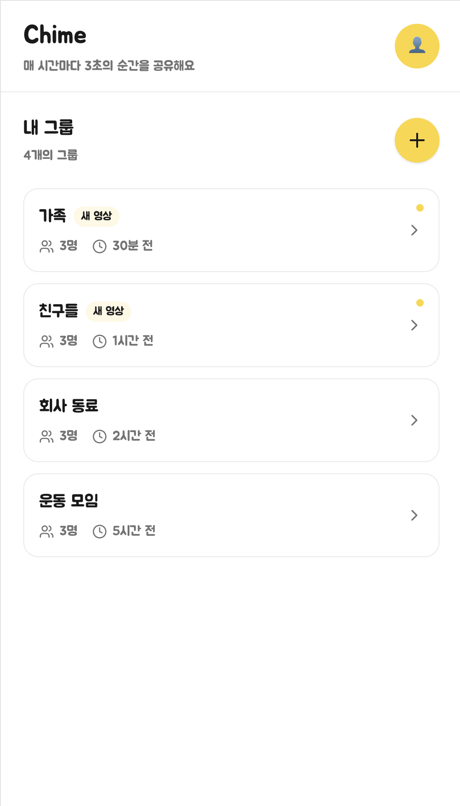

# main — UI

## 목업



> 위 목업은 초기 컨셉. 워드마크는 "Chime" → **"ChimeMe"**로 변경 필요 (`spec/main/ui.md §1` 참조).

## 레이아웃 (위에서 아래로)

### 1. 앱 헤더
- 좌측
  - 타이틀: **ChimeMe** (굵은 sans-serif) — 목업 이미지의 "Chime" 표기는 ChimeMe로 갱신 필요
  - 서브타이틀: "매 시간마다 3초의 순간을 공유해요" (옅은 그레이)
- 우측: 노란 원형 프로필 진입 버튼 (사람 아이콘)
- 헤더 아래 1px 옅은 구분선

### 2. 섹션 헤더 — "내 그룹"
- 좌측
  - 굵은 헤딩: **내 그룹**
  - 서브: "N개의 그룹" (옅은 그레이)
- 우측: 노란 원형 **+** FAB (그룹 생성/추가)

### 3. 그룹 카드 리스트 (세로 스택)
각 카드:
```
┌────────────────────────────────────────┐
│  [그룹명]  [새 영상]              [●] │
│                                        │
│  👥 N명   🕒 N분 전             [▶] │
└────────────────────────────────────────┘
```
- 카드 배경: 화이트
- 보더: 옅은 그레이 라운드
- 라운드: 16px 가량
- 우측 점(●): 새 영상이 있을 때만 노란 점
- 우측 화살표(▶): 상세 진입 affordance
- 카드 사이 간격: 12px

## 디자인 토큰
| 토큰 | 값 |
|---|---|
| `color.primary` | `#FFD54F` 톤 (실제 값 추후 확정) |
| `color.surface` | `#FFFFFF` |
| `color.surfaceMuted` | 옅은 그레이 (#F5F5F5 톤) |
| `color.textPrimary` | 짙은 그레이/블랙 |
| `color.textMuted` | 중간 그레이 |
| `color.dotNew` | `color.primary` |
| `radius.card` | 16 |
| `radius.fab` | 999 (원형) |

## 컴포넌트
- `AppHeader` — 타이틀 + 서브 + 우상단 아이콘 슬롯
- `SectionHeader` — 헤딩 + 카운트 + 우측 액션 슬롯
- `GroupCard` — `{ name, hasNewVideo, memberCount, lastActivityAt }`
- `PrimaryFAB` — 노란 원형 + 아이콘
- `NewBadge` — 옅은 노란 칩, "새 영상" 텍스트

## 빈 상태
- 가입한 그룹이 0개일 때:
  - 일러스트(추후) + "아직 그룹이 없어요"
  - "그룹 만들기" 큰 버튼 (+FAB과 동작 동일)

## 로딩 상태
- 카드 자리에 옅은 회색 스켈레톤 3장
